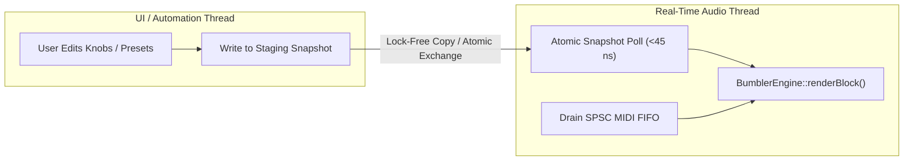

# Bumbler XD: C++20 DSP Core API Reference & Integration Guide

Comprehensive API documentation, threading contracts, real-time safety guarantees, and host integration patterns for `bumbler_dsp_core`.

---

## Table of Contents

- [1. Architecture Overview & Quickstart](#1-architecture-overview--quickstart)
- [2. Public Header Hierarchy](#2-public-header-hierarchy)
- [3. Core DSP Classes Reference](#3-core-dsp-classes-reference)
  - [3.1 BumblerEngine](#31-bumblerengine)
  - [3.2 BumblerVoiceManager](#32-bumblervoicemanager)
  - [3.3 ParameterSnapshot](#33-parametersnapshot)
  - [3.4 CharacterCircuits](#34-charactercircuits)
  - [3.5 Subordinate DSP Modules](#35-subordinate-dsp-modules)
- [4. Real-Time Safety & Threading Contracts](#4-real-time-safety--threading-contracts)
  - [4.1 Threading Model & Single-Thread Audio Invariant](#41-threading-model--single-thread-audio-invariant)
  - [4.2 Lock-Free Parameter Snapshot Passing](#42-lock-free-parameter-snapshot-passing)
  - [4.3 Real-Time Safety Rules (Hard Real-Time Audio Constraints)](#43-real-time-safety-rules-hard-real-time-audio-constraints)
  - [4.4 Denormal Handling (Hardware FTZ/DAZ & Software Guards)](#44-denormal-handling-hardware-ftzdaz--software-guards)
- [5. Integration Guide for Third-Party Hosts](#5-integration-guide-for-third-party-hosts)
  - [5.1 Digital Audio Workstations (JUCE 8 / VST3 / CLAP)](#51-digital-audio-workstations-juce-8--vst3--clap)
  - [5.2 Game Engines (Unreal Engine 5 & Unity)](#52-game-engines-unreal-engine-5--unity)
  - [5.3 Embedded Systems & Headless Linux (ALSA / JACK / Bela)](#53-embedded-systems--headless-linux-alsa--jack--bela)
- [6. Complete End-to-End C++20 Example](#6-complete-end-to-end-c20-example)
- [7. Known Limitations & Architectural Boundaries](#7-known-limitations--architectural-boundaries)

---

## 1. Architecture Overview & Quickstart

`bumbler_dsp_core` is an ISO C++20 static DSP library providing the complete sound generation, polyphonic voice allocation, filtering, and character circuits of the Bumbler XD synthesizer.

### Key Architectural Characteristics
- **Zero Dynamic Memory Allocation:** Pre-allocates all voice state buffers, lookup tables, and delay lines during `prepare()`. Zero heap allocations (`malloc`, `free`, `new`, `delete`) occur in audio loops.
- **POD Parameter Exchange:** Uses a 55-member plain-old-data structure (`ParameterSnapshot`) for atomic, lock-free parameter handoffs between GUI/automation threads and real-time audio threads ($<45\text{ ns}$ extraction latency).
- **Hard Real-Time Guarantees:** All audio rendering methods are annotated `noexcept` and guarantee deterministic execution time without mutexes, spinlocks, or operating system blocking calls.
- **Host Agnostic:** Contains zero framework dependencies (JUCE is strictly confined to the plugin wrapper layer). The core library compiles cleanly with MSVC, Apple Clang, and GCC.

### Minimal C++20 Quickstart (~50 Lines)

The following self-contained example (`examples/minimal_integration.cpp`) shows the absolute minimum C++20 code required to instantiate `BumblerEngine`, prepare it at 48 kHz / 512 block size, load a factory preset `ParameterSnapshot`, trigger a MIDI Note On (note 60, velocity 0.8), render 512 stereo samples into raw float arrays, and verify audio output—with zero JUCE GUI, windowing, or CLI dependencies:

```cpp
#include <iostream>
#include <array>
#include <cmath>
#include <algorithm>
#include "BumblerEngine.h"
#include "ParameterSnapshot.h"
#include "parameters/PresetParameters.h"

int main() {
    // 1. Instantiate the headless C++20 DSP engine
    bumbler::BumblerEngine engine;

    constexpr double sampleRate = 48000.0;
    constexpr int blockSize = 512;

    // 2. Prepare engine at 48 kHz with 512 max block size
    engine.prepare(sampleRate, blockSize);
    engine.reset();

    // 3. Load a factory preset ParameterSnapshot (Preset 0: Acid Bass)
    const auto& presets = bumbler::getFactoryPresets();
    const bumbler::ParameterSnapshot params = presets[0].params;

    // 4. Trigger MIDI Note On: Note 60 (Middle C), Velocity 0.8
    engine.processMidiEvent(0x90, 60, 0.8f);

    // 5. Render 512 stereo samples into float arrays
    std::array<float, blockSize> leftChannel{};
    std::array<float, blockSize> rightChannel{};
    float* outputChannels[2] = { leftChannel.data(), rightChannel.data() };

    engine.renderBlock(outputChannels, 2, blockSize, params);

    // 6. Verify audio output (non-silent, finite samples)
    float peak = 0.0f;
    bool hasNonZero = false;
    bool allFinite = true;

    for (int i = 0; i < blockSize; ++i) {
        const float l = leftChannel[i];
        const float r = rightChannel[i];
        if (!std::isfinite(l) || !std::isfinite(r)) allFinite = false;
        if (std::abs(l) > 1e-5f || std::abs(r) > 1e-5f) hasNonZero = true;
        peak = std::max({peak, std::abs(l), std::abs(r)});
    }

    if (allFinite && hasNonZero) {
        std::cout << "[SUCCESS] BumblerEngine rendered " << blockSize 
                  << " stereo samples. Peak: " << peak << " (" << presets[0].name << ")\n";
        return 0;
    }

    std::cerr << "[FAILURE] Audio output verification failed.\n";
    return 1;
}
```

---

## 2. Public Header Hierarchy

All core DSP headers reside in `source/dsp/` under the `bumbler` namespace:

| Header File | Primary Classes / Structs | Description |
| :--- | :--- | :--- |
| `BumblerCommon.h` | `ScopedNoDenormals`, `FastSinTable`, `OnePoleDCBlocker`, math utilities | Numerical constants, hardware FTZ/DAZ guards, 4th-order PolyBLEP functions, enumeration types. |
| `ParameterSnapshot.h` | `ParameterSnapshot` | 55-member trivially copyable POD parameter container. |
| `BumblerEngine.h` | `BumblerEngine` | Top-level engine orchestrating voice management, MIDI event translation, and audio rendering. |
| `BumblerVoiceManager.h` | `BumblerVoiceManager` | 16-voice polyphonic allocator with 4-tier stealing strategy and scratch downmix buffers. |
| `BumblerVoice.h` | `BumblerVoice` | Per-voice synthesis pipeline combining oscillators, 6-mode ZDF filter, dual LFOs, and envelopes. |
| `BumblerOscillator.h` | `BumblerOscillator`, `BumblerTripleOscillatorSection` | 4th-order PolyBLEP anti-aliased oscillators, ring modulator, and linear audio-rate FM engine. |
| `WaspFilter.h` | `WaspFilter`, `SvfStage`, `WaspFilterMode` | Zero-delay feedback (ZDF) state-variable filter cascade with CMOS inverter saturation modeling. |
| `BumblerEnvelopes.h` | `BumblerADSR`, `BumblerModEnvelope`, `BumblerDualADSR` | 4-stage exponential envelopes (Amp/Filter) with `LINK` sync, and Attack-Decay MOD envelope. |
| `BumblerLFO.h` | `BumblerLFO` | 64-bit IEEE double-precision low-frequency oscillator with tempo-sync and onset delay. |
| `CharacterCircuits.h` | `CharacterCircuits`, `DistortionUnit`, `DualModeVoiceDoubler`, `AnalogVoiceDrift`, `NoiseEngine` | Asymmetric tanh overdrive, 1-pole tone tilt, Haas 5ms stereo decorrelator, and Galois LFSR noise. |

---

## 3. Core DSP Classes Reference

### 3.1 BumblerEngine

The mandated top-level entry point for synthesizer instantiation and audio rendering.

```cpp
namespace bumbler {

class BumblerEngine {
public:
    BumblerEngine() noexcept = default;

    /**
     * Prepares the engine, voices, filters, and character circuits.
     * @param sampleRate Output sampling frequency in Hz (defensively clamped to [1000.0, 384000.0]).
     * @param maxBlockSize Maximum expected buffer size in frames (defensively clamped to [1, 8192]).
     */
    void prepare(double sampleRate, int maxBlockSize) noexcept;

    /**
     * Resets all internal voice states, filter integrator memories, LFO phases, and envelope stages.
     */
    void reset() noexcept;

    /**
     * Dispatches a single raw MIDI event sequentially on the audio thread.
     * @param status MIDI status byte (e.g., 0x90 Note-On, 0x80 Note-Off, 0xB0 CC, 0xE0 Pitch Bend).
     * @param noteNumber Note number [0, 127] or CC controller index.
     * @param velocity Normalized velocity [0.0f, 1.0f] (or bipolar [-1.0f, +1.0f] for pitch bend).
     */
    void processMidiEvent(int status, int noteNumber, float velocity) noexcept;

    /**
     * Renders synthesized audio into the supplied output buffers.
     * Automatically applies ScopedNoDenormals guard.
     * @param outputChannels Array of channel pointers (e.g. {left, right}).
     * @param numChannels Number of channels (1 for mono downmix, 2 for stereo).
     * @param numSamples Number of audio frames to render.
     * @param params Immutable parameter snapshot for this block.
     */
    void renderBlock(float* const* outputChannels, int numChannels, int numSamples, const ParameterSnapshot& params) noexcept;

    /** Sets the host playback tempo in Beats Per Minute for tempo-synced LFOs. */
    void setHostBpm(float bpm) noexcept;
    [[nodiscard]] float getHostBpm() const noexcept;

    // Sub-component access
    [[nodiscard]] BumblerVoiceManager& getVoiceManager() noexcept;
    [[nodiscard]] const BumblerVoiceManager& getVoiceManager() const noexcept;
    [[nodiscard]] CharacterCircuits& getCharacterCircuits() noexcept;
    [[nodiscard]] const CharacterCircuits& getCharacterCircuits() const noexcept;
};

} // namespace bumbler
```

#### Invariants & Safety Notes
- `prepare()` must be called before calling `renderBlock()`. Re-calling `prepare()` at runtime dynamically updates the internal sampling rate and recalculates all filter pre-warping factors ($g$) and oscillator phase increments ($dt$).
- `renderBlock()` is strictly re-entrant across separate `BumblerEngine` instances, but must not be called concurrently on the same instance from multiple threads.

---

### 3.2 BumblerVoiceManager

Manages dynamic polyphonic voice allocation and voice stealing across up to 16 concurrent voices.

```cpp
namespace bumbler {

class BumblerVoiceManager {
public:
    static constexpr int kMaxVoices = 16;

    BumblerVoiceManager() noexcept = default;

    void prepare(double sampleRate, int maxBlockSize) noexcept;
    void reset() noexcept;

    // MIDI Note & Transport Dispatch
    void noteOn(int midiNote, float velocity) noexcept;
    void noteOff(int midiNote, float velocity = 0.0f) noexcept;
    void setSustainPedal(bool pedalDown) noexcept;
    void setPitchBend(float semitones) noexcept;
    void allNotesOff(bool fastKill = false) noexcept;

    // Polyphony Limit Configuration (1 to 16)
    void setPolyphonyLimit(int limit) noexcept;
    [[nodiscard]] int getPolyphonyLimit() const noexcept;

    // Diagnostics & Inspection
    [[nodiscard]] int getNumActiveVoices() const noexcept;
    [[nodiscard]] const BumblerVoice& getVoice(int index) const noexcept;
    [[nodiscard]] BumblerVoice& getVoice(int index) noexcept;

    void setFilterEnabled(bool enabled) noexcept;
    [[nodiscard]] bool isFilterEnabled() const noexcept;

    void setHostBpm(float bpm) noexcept;
    [[nodiscard]] float getHostBpm() const noexcept;

    void setAnalogMode(bool enabled) noexcept;
    [[nodiscard]] bool isAnalogMode() const noexcept;

    [[nodiscard]] CharacterCircuits& getCharacterCircuits() noexcept;
    [[nodiscard]] const CharacterCircuits& getCharacterCircuits() const noexcept;

    // Direct multi-channel rendering
    void renderBlock(float* const* outputChannels, int numChannels, int numSamples, const ParameterSnapshot& params) noexcept;
};

} // namespace bumbler
```

#### Deterministic 4-Tier Voice Allocation Strategy
When `noteOn(midiNote, velocity)` is called, the manager executes a deterministic 4-tier allocation algorithm:
1. **Tier 1 (Same-Pitch Retriggering):** If an active voice is currently playing `midiNote`, that voice is retriggered in-place. This preserves phase continuity, prevents voice pileup on fast repeated notes, and conserves polyphony.
2. **Tier 2 (Free / Inactive Voice Acquisition):** Scans the active polyphony pool $[0, \text{mMaxPolyphony}-1]$ via round-robin starting at $(\text{mLastAllocatedIndex} + 1)$. The first inactive voice is assigned.
3. **Tier 3 (Oldest Releasing Voice Stealing):** If all voices are active, the pool is scanned for voices currently in the Release stage (`isReleasing() == true`). The releasing voice with the lowest trigger timestamp is stolen.
4. **Tier 4 (Oldest Held Voice Stealing / LRU Fallback):** If all voices are held, the voice with the oldest trigger timestamp is stolen.
5. **Anti-Click Smooth Crossfade:** When a voice is stolen in Tier 3 or 4, it engages a 5ms Hann-windowed de-click crossfader to fade out the previous note without audible clicks.

---

### 3.3 ParameterSnapshot

The central parameter exchange structure for the entire synthesizer.

```cpp
namespace bumbler {

struct ParameterSnapshot {
    // Group 1: Oscillators & Voice Management (14 parameters)
    float osc1Waveform { 0.0f };  // 0=Saw, 1=Square, 2=Sine, 3=Noise
    float osc1Octave   { 0.0f };  // -3 to +3 octaves
    float osc1Fine     { 0.0f };  // -1 to +1 semitones (-100 to +100 cents)
    float osc2Waveform { 0.0f };  // 0=Saw, 1=Square, 2=Sine, 3=Noise
    float osc2Octave   { 0.0f };  // -3 to +3 octaves
    float osc2Fine     { 0.0f };  // -1 to +1 semitones (-100 to +100 cents)
    float oscMix       { 0.5f };  // 0.0 (OSC 1) to 1.0 (OSC 2)
    float osc3Waveform { 0.0f };  // 0=Square, 1=Saw
    float osc3Level    { 0.0f };  // 0.0 to 1.0
    float ringModMix   { 0.0f };  // 0.0 to 1.0 (Off / Blend / On)
    float pulseWidth   { 0.5f };  // 0.01 to 0.99
    float fmAmount     { 0.0f };  // 0.0 to 1.0 (OSC 1 mod OSC 2)
    float velToAmp     { 0.5f };  // 0.0 to 1.0 velocity depth to Amp ADSR
    float velToFilter  { 0.5f };  // 0.0 to 1.0 velocity depth to Filter ADSR

    // Group 2: 6-Mode Filter Section (5 parameters)
    float filterMode      { 1.0f };    // 0=LP12, 1=LP24, 2=LP+NT, 3=DBL.NT, 4=BP24, 5=HP24
    float filterCutoff    { 1200.0f }; // 20.0 to 20000.0 Hz
    float filterResonance { 0.2f };    // 0.0 to 1.0
    float filterKbTrack   { 0.5f };    // 0.0 to 1.0
    float filterEnvAmount { 0.0f };    // -1.0 to +1.0 (Bipolar)

    // Group 3: Envelopes (13 parameters)
    float ampAttack     { 0.01f }; // 0.001 to 10.0 seconds
    float ampDecay      { 0.30f }; // 0.001 to 10.0 seconds
    float ampSustain    { 0.80f }; // 0.0 to 1.0 level
    float ampRelease    { 0.30f }; // 0.001 to 10.0 seconds

    float filterAttack  { 0.05f }; // 0.001 to 10.0 seconds
    float filterDecay   { 0.50f }; // 0.001 to 10.0 seconds
    float filterSustain { 0.50f }; // 0.0 to 1.0 level
    float filterRelease { 0.40f }; // 0.001 to 10.0 seconds
    float envLink       { 0.0f };  // 0.0 or 1.0 (Link toggle)

    float modAttack     { 0.05f }; // 0.001 to 5.0 seconds
    float modDecay      { 0.50f }; // 0.001 to 10.0 seconds
    float modAmount     { 0.0f };  // -1.0 to +1.0 (Bipolar)
    float modTarget     { 0.0f };  // 0=PW, 1=LFO1Amt, 2=Osc1Level, 3=Osc2Pitch

    // Group 4: Dual LFOs (16 parameters: 8 for LFO 1, 8 for LFO 2)
    float lfo1Waveform { 2.0f }; // 0=Saw, 1=Square, 2=Sine, 3=Noise
    float lfo1Rate     { 2.0f }; // 0.05 to 30.0 Hz
    float lfo1Delay    { 0.0f }; // 0.0 to 5.0 seconds
    float lfo1Sync     { 0.0f }; // 0.0 (Free) or 1.0 (Sync)
    float lfo1SyncDiv  { 3.0f }; // Musical division (0=1/32 .. 5=1/1, 3=1/4 default)
    float lfo1KeyReset { 1.0f }; // 0.0 or 1.0
    float lfo1Amount   { 0.0f }; // 0.0 to 1.0
    float lfo1Target   { 1.0f }; // 0=Osc12Pitch, 1=FilterCutoff, 2=PulseWidth

    float lfo2Waveform { 2.0f }; // 0=Saw, 1=Square, 2=Sine, 3=Noise
    float lfo2Rate     { 1.0f }; // 0.05 to 30.0 Hz
    float lfo2Delay    { 0.0f }; // 0.0 to 5.0 seconds
    float lfo2Sync     { 0.0f }; // 0.0 (Free) or 1.0 (Sync)
    float lfo2SyncDiv  { 4.0f }; // Musical division (4=1/2 default)
    float lfo2KeyReset { 1.0f }; // 0.0 or 1.0
    float lfo2Amount   { 0.0f }; // 0.0 to 1.0
    float lfo2Target   { 0.0f }; // 0=Osc1Pitch, 1=OscMix, 2=MasterAmp

    // Group 5: Character & Master Output (7 parameters)
    float driveEnabled { 0.0f }; // 0.0 or 1.0
    float driveAmount  { 0.3f }; // 0.0 to 1.0
    float driveTone    { 0.5f }; // 0.0 (dark) to 1.0 (bright)
    float dualMode     { 0.0f }; // 0.0 or 1.0
    float analogMode   { 0.0f }; // 0.0 or 1.0
    float wNoiseMode   { 0.0f }; // 0=Vintage Table, 1=White Noise
    float masterVolume { 0.8f }; // 0.0 to 1.0
};

// POD Contract Static Verification
static_assert(std::is_standard_layout_v<ParameterSnapshot>);
static_assert(std::is_trivially_copyable_v<ParameterSnapshot>);
static_assert(sizeof(ParameterSnapshot) == 55 * sizeof(float));

} // namespace bumbler
```

---

### 3.4 CharacterCircuits

Master stereo character processing stage implementing non-linear overdrive, Haas stereo widening, analog drift, and DC blocking.

```cpp
namespace bumbler {

class CharacterCircuits {
public:
    CharacterCircuits() noexcept = default;

    void prepare(double sampleRate, int maxBlockSize = 512) noexcept;
    void reset() noexcept;

    /** In-place stereo block processing. */
    void processStereo(float* outL, float* outR, int numSamples, const ParameterSnapshot& params) noexcept;

    /** Multi-channel block processing (mono or stereo). */
    void processBlock(float* const* channels, int numChannels, int numSamples, const ParameterSnapshot& params) noexcept;

    // Component accessors
    [[nodiscard]] DistortionUnit& getDistortion() noexcept;
    [[nodiscard]] const DistortionUnit& getDistortion() const noexcept;

    [[nodiscard]] DualModeVoiceDoubler& getDualMode() noexcept;
    [[nodiscard]] const DualModeVoiceDoubler& getDualMode() const noexcept;

    [[nodiscard]] AnalogVoiceDrift& getAnalogDrift() noexcept;
    [[nodiscard]] const AnalogVoiceDrift& getAnalogDrift() const noexcept;

    [[nodiscard]] NoiseEngine& getNoiseEngine() noexcept;
    [[nodiscard]] const NoiseEngine& getNoiseEngine() const noexcept;
};

} // namespace bumbler
```

---

### 3.5 Subordinate DSP Modules

The following standalone classes are directly available for embedding into custom DSP pipelines:

- **`WaspFilter`:** Complete 6-mode Zero-Delay Feedback State-Variable Filter. Supports both per-sample (`processSample`) and block processing with 16-sample sub-block parameter smoothing (`processBlock`).
- **`BumblerOscillator`:** 4th-order PolyBLEP anti-aliased oscillator generating Saw, Square/PWM, Sine, and Noise.
- **`BumblerTripleOscillatorSection`:** Integrated triple-oscillator mixer with equal-power balance fader, ring modulator with DC blocking, and audio-rate FM.
- **`BumblerADSR`:** 4-stage exponential envelope with denormal-flushing and state inspection.
- **`BumblerModEnvelope`:** 2-stage Attack-Decay envelope with bipolar depth scaling.
- **`BumblerLFO`:** 64-bit IEEE double-precision phase accumulator LFO with tempo synchronization and onset delay.
- **`ScopedNoDenormals`:** Cross-platform RAII guard configuring hardware FTZ (Flush-To-Zero) and DAZ (Denormals-Are-Zero) on x86/x64 (via MXCSR) and ARM64 (via FPCR).

---

## 4. Real-Time Safety & Threading Contracts

### 4.1 Threading Model & Single-Thread Audio Invariant

`BumblerEngine` and `BumblerVoiceManager` are designed for **synchronous, single-threaded execution on the real-time audio thread**.
- `processMidiEvent()` and `renderBlock()` must be called sequentially from the same thread.
- If the host receives MIDI events on a background thread (e.g. from an OS MIDI driver callback), it must queue them into a lock-free Single-Producer Single-Consumer (SPSC) ring buffer and drain them on the audio thread immediately prior to calling `renderBlock()`.



### 4.2 Lock-Free Parameter Snapshot Passing

The `ParameterSnapshot` struct is trivially copyable (`sizeof == 220` bytes on 32/64-bit architectures). Hosts can pass parameters safely using one of two lock-free patterns:

#### Pattern A: Atomic Float APVTS Polling (JUCE Standard)
In JUCE wrappers, the audio thread reads atomic parameter floats directly into a local snapshot before calling `renderBlock()`:

```cpp
bumbler::ParameterSnapshot snapshot;
snapshot.filterCutoff = cutoffParam->load(std::memory_order_relaxed);
snapshot.filterResonance = resoParam->load(std::memory_order_relaxed);
// ... remaining parameters ...
mEngine.renderBlock(channelPointers, numChannels, numSamples, snapshot);
```
Extraction takes $<45\text{ ns}$ for all 55 parameters on modern x64 and ARM64 CPUs.

#### Pattern B: Triple-Buffering / Atomic Pointer Swap (C++20 Standard)
For non-JUCE hosts, parameter snapshots can be published from the UI thread and consumed on the audio thread using an atomic pointer exchange or triple buffer:

```cpp
std::atomic<const bumbler::ParameterSnapshot*> gActiveSnapshot;

// On audio thread:
const bumbler::ParameterSnapshot* currentParams = gActiveSnapshot.load(std::memory_order_acquire);
mEngine.renderBlock(buffers, channels, frames, *currentParams);
```

### 4.3 Real-Time Safety Rules (Hard Real-Time Audio Constraints)

The audio rendering methods adhere to strict real-time audio safety standards:
1. **Zero Dynamic Allocation:** `malloc()`, `free()`, `new`, and `delete` are completely prohibited in `renderBlock()`.
2. **Zero Locking:** No mutexes, condition variables, spinlocks, or read-write locks.
3. **No System Calls or File I/O:** No disk access, socket communication, printfs, or logging.
4. **Bounded Iteration:** Every loop bound is strictly deterministic and proportional to `numSamples` or `kMaxVoices` (16).
5. **Noexcept Exception Guarantee:** Every method on the audio path is declared `noexcept`.
6. **Poison Input Immunity:** All audio and parameter inputs are checked and clamped against non-finite values (NaN, Inf) using bitwise IEEE 754 inspection (`isFiniteBitwise`).

### 4.4 Denormal Handling (Hardware FTZ/DAZ & Software Guards)

Subnormal (denormal) floating-point values generated during exponential decay can drop CPU pipelines into software microcode emulation, causing $100\times$ CPU spikes.

Bumbler XD implements a two-tier defense:
1. **Hardware Tier (RAII Guard):** `ScopedNoDenormals` is instantiated at the entry point of `renderBlock()`. It configures the CPU floating-point status registers for hardware FTZ and DAZ:
   - **x86_64 / x86:** Sets MXCSR bits 15 (FTZ) and 6 (DAZ) via `_mm_setcsr()`.
   - **ARM64:** Sets FPCR bit 24 (FZ) via status register intrinsics.
2. **Software Tier (Bitwise Flush):** Envelopes, DC blockers, and filters apply `flushDenormal(val)`:
   ```cpp
   [[nodiscard]] inline float flushDenormal(float val) noexcept {
       return (std::abs(val) < 1.0e-15f) ? 0.0f : val;
   }
   ```

---

## 5. Integration Guide for Third-Party Hosts

### 5.1 Digital Audio Workstations (JUCE 8 / VST3 / CLAP)

In a JUCE `AudioProcessor` implementation, integrate `BumblerEngine` as follows:

```cpp
#include "dsp/BumblerEngine.h"
#include "dsp/ParameterSnapshot.h"

class BumblerAudioProcessor : public juce::AudioProcessor {
public:
    void prepareToPlay(double sampleRate, int samplesPerBlock) override {
        mEngine.prepare(sampleRate, samplesPerBlock);
    }

    void releaseResources() override {
        mEngine.reset();
    }

    void processBlock(juce::AudioBuffer<float>& buffer, juce::MidiBuffer& midiMessages) override {
        juce::ScopedNoDenormals noDenormals;

        // 1. Update host transport tempo
        if (auto* playHead = getPlayHead()) {
            if (auto pos = playHead->getPosition()) {
                if (pos->getBpm()) {
                    mEngine.setHostBpm(static_cast<float>(*pos->getBpm()));
                }
            }
        }

        // 2. Dispatch MIDI events sequentially
        for (const auto metadata : midiMessages) {
            const auto msg = metadata.getMessage();
            if (msg.isNoteOn()) {
                mEngine.processMidiEvent(0x90, msg.getNoteNumber(), msg.getFloatVelocity());
            } else if (msg.isNoteOff()) {
                mEngine.processMidiEvent(0x80, msg.getNoteNumber(), msg.getFloatVelocity());
            } else if (msg.isPitchWheel()) {
                // Normalize 14-bit pitch wheel [0, 16383] to [-1.0, +1.0]
                const float normBend = static_cast<float>(msg.getPitchWheelValue() - 8192) / 8192.0f;
                mEngine.processMidiEvent(0xE0, 0, normBend);
            } else if (msg.isController()) {
                mEngine.processMidiEvent(0xB0, msg.getControllerNumber(), static_cast<float>(msg.getControllerValue()) / 127.0f);
            }
        }

        // 3. Extract parameter snapshot
        bumbler::ParameterSnapshot snapshot = extractSnapshotFromAPVTS();

        // 4. Render audio
        auto* const* channelData = buffer.getArrayOfWritePointers();
        mEngine.renderBlock(channelData, buffer.getNumChannels(), buffer.getNumSamples(), snapshot);
    }

private:
    bumbler::BumblerEngine mEngine;
    bumbler::ParameterSnapshot extractSnapshotFromAPVTS() noexcept;
};
```

---

### 5.2 Game Engines (Unreal Engine 5 & Unity)

#### Unreal Engine 5 (MetaSounds / Submix Synthesis)

Integrate `BumblerEngine` into an Unreal Engine `ISubmixBufferListener` or custom `Audio::FMixerSubmix`:

```cpp
#include "dsp/BumblerEngine.h"

class FBumblerSubmixEffect : public FSoundEffectSubmix {
public:
    virtual void Init(const FSoundEffectSubmixInitData& InitData) override {
        Engine.prepare(InitData.SampleRate, 1024);
    }

    virtual void OnProcessAudio(const FSoundEffectSubmixInputData& InData, FSoundEffectSubmixOutputData& OutData) override {
        const int32 NumFrames = InData.NumFrames;
        float* Channels[2] = { OutData.AudioBuffer->GetData(), OutData.AudioBuffer->GetData() + NumFrames };

        // Atomic snapshot load
        const bumbler::ParameterSnapshot CurrentParams = ActiveParams.load();
        Engine.renderBlock(Channels, 2, NumFrames, CurrentParams);
    }

private:
    bumbler::BumblerEngine Engine;
    TAtomic<bumbler::ParameterSnapshot> ActiveParams;
};
```

#### Unity 3D (C# Native Audio Plugin API)

Compile `bumbler_dsp_core` into a native dynamic library (`BumblerAudioPlugin.dll` / `.so` / `.dylib`) and export C linkage functions:

```cpp
extern "C" {
    UNITY_AUDIODSP_EXPORT_API BumblerEngine* Bumbler_Create(double sampleRate, int maxBlock) {
        auto* engine = new bumbler::BumblerEngine();
        engine->prepare(sampleRate, maxBlock);
        return engine;
    }

    UNITY_AUDIODSP_EXPORT_API void Bumbler_ProcessMidi(BumblerEngine* engine, int status, int note, float vel) {
        if (engine) engine->processMidiEvent(status, note, vel);
    }

    UNITY_AUDIODSP_EXPORT_API void Bumbler_Render(
        BumblerEngine* engine,
        float* buffer,
        int numChannels,
        int numSamples,
        const bumbler::ParameterSnapshot* params
    ) {
        if (!engine || !buffer || !params) return;
        float* channels[2] = { buffer, (numChannels > 1) ? buffer + numSamples : nullptr };
        engine->renderBlock(channels, numChannels, numSamples, *params);
    }

    UNITY_AUDIODSP_EXPORT_API void Bumbler_Destroy(BumblerEngine* engine) {
        delete engine;
    }
}
```

---

### 5.3 Embedded Systems & Headless Linux (ALSA / JACK / Bela)

`bumbler_dsp_core` is compatible with embedded Linux audio platforms (Raspberry Pi 4/5, Bela, Teensy 4.1, and STM32H7 bare-metal).

#### JACK Audio Connection Kit Callback Example

```cpp
#include <jack/jack.h>
#include "dsp/BumblerEngine.h"

static bumbler::BumblerEngine gEngine;
static bumbler::ParameterSnapshot gParams;
static jack_port_t* gOutputPortL = nullptr;
static jack_port_t* gOutputPortR = nullptr;

static int processJackAudio(jack_nframes_t nframes, void* /*arg*/) {
    auto* outL = static_cast<float*>(jack_port_get_buffer(gOutputPortL, nframes));
    auto* outR = static_cast<float*>(jack_port_get_buffer(gOutputPortR, nframes));

    float* channels[2] = { outL, outR };
    gEngine.renderBlock(channels, 2, static_cast<int>(nframes), gParams);
    return 0;
}

int main() {
    jack_client_t* client = jack_client_open("BumblerXD", JackNullOption, nullptr);
    const double sampleRate = jack_get_sample_rate(client);
    const jack_nframes_t bufferSize = jack_get_buffer_size(client);

    gEngine.prepare(sampleRate, static_cast<int>(bufferSize));

    gOutputPortL = jack_port_register(client, "out_left", JACK_DEFAULT_AUDIO_TYPE, JackPortIsOutput, 0);
    gOutputPortR = jack_port_register(client, "out_right", JACK_DEFAULT_AUDIO_TYPE, JackPortIsOutput, 0);

    jack_set_process_callback(client, processJackAudio, nullptr);
    jack_activate(client);

    // Main loop running headless MIDI or parameter CLI
    // ...
    return 0;
}
```

---

## 6. Complete End-to-End C++20 Example

The following standalone C++20 program demonstrates initializing `BumblerEngine`, setting up a `ParameterSnapshot`, triggering notes, and rendering 480 stereo samples to memory:

```cpp
#include <iostream>
#include <vector>
#include "dsp/BumblerEngine.h"
#include "dsp/ParameterSnapshot.h"

int main() {
    // 1. Instantiate engine
    bumbler::BumblerEngine engine;

    constexpr double kSampleRate = 48000.0;
    constexpr int kBlockSize = 480;

    // 2. Prepare audio subsystem
    engine.prepare(kSampleRate, kBlockSize);

    // 3. Configure a custom synth patch in ParameterSnapshot
    bumbler::ParameterSnapshot patch;
    patch.osc1Waveform = 0.0f;           // Sawtooth
    patch.osc2Waveform = 1.0f;           // Square/Pulse
    patch.pulseWidth   = 0.35f;          // 35% duty cycle
    patch.oscMix       = 0.5f;           // 50/50 balance
    patch.fmAmount     = 0.15f;          // Subtle linear FM
    patch.filterMode   = 1.0f;           // Mode 1: LP24 FAT (with CMOS saturation)
    patch.filterCutoff = 1800.0f;        // 1.8 kHz cutoff
    patch.filterResonance = 0.65f;       // Resonant squelch
    patch.driveEnabled = 1.0f;           // Engage vintage overdrive
    patch.driveAmount  = 0.40f;
    patch.driveTone    = 0.60f;
    patch.dualMode     = 1.0f;           // Engage 5ms Haas stereo widening
    patch.masterVolume = 0.85f;

    // 4. Dispatch MIDI Note-On: Middle C (MIDI Note 60), Velocity 100/127
    engine.processMidiEvent(0x90, 60, 100.0f / 127.0f);

    // 5. Allocate stereo output buffers
    std::vector<float> bufferL(kBlockSize, 0.0f);
    std::vector<float> bufferR(kBlockSize, 0.0f);
    float* channelPointers[2] = { bufferL.data(), bufferR.data() };

    // 6. Render audio block
    engine.renderBlock(channelPointers, 2, kBlockSize, patch);

    // 7. Inspect rendered peak amplitude
    float peakL = 0.0f;
    for (float s : bufferL) peakL = std::max(peakL, std::abs(s));

    std::cout << "Successfully rendered " << kBlockSize << " stereo samples." << std::endl;
    std::cout << "Peak Left Channel Amplitude: " << peakL << " (" << 20.0f * std::log10(peakL) << " dBFS)" << std::endl;

    return 0;
}
```

---

## 7. Known Limitations & Architectural Boundaries

`bumbler_dsp_core` prioritizes hard real-time safety, zero-allocation determinism, and faithful recreation of the EDP Wasp XT hardware architecture. In service of these architectural commitments, several explicit boundaries are enforced across the DSP engine and host integration layers:

### 7.1 Fixed 16-Voice Polyphony Ceiling
- **Preallocated Memory Guarantee:** The polyphony ceiling is fixed at compile-time to 16 concurrent voices (`static constexpr int kMaxVoices = 16`). All voice synthesis structures (`BumblerVoice`), filter memories, modulation accumulators, and crossfade buffers are pre-allocated in static arrays (`std::array<BumblerVoice, 16>`).
- **Zero Real-Time Allocations:** This upper ceiling guarantees strictly zero heap allocations (`malloc`, `free`, `new`, `delete`) and zero pointer indirection or memory fragmentation during audio rendering.
- **Dynamic Downward Scaling:** Hosts can dynamically throttle polyphony between 1 and 16 voices via `BumblerVoiceManager::setPolyphonyLimit(int limit)` to conserve CPU on resource-constrained platforms (e.g. mobile or embedded devices). However, increasing polyphony beyond 16 requires modifying `kMaxVoices` and recompiling the core library.

### 7.2 Channel-Global Pitch Bend & Continuous Controllers (No Per-Note MPE)
- **Standard MIDI 1.0 Architecture:** Pitch bend, sustain pedal (CC 64), and continuous modulation controllers operate on a global, channel-wide basis across all active voices.
- **No MPE Support:** MIDI Polyphonic Expression (MPE / MIDI 2.0 per-note pitch bend, polyphonic aftertouch, and per-note timbre dimensions) is not supported in the current engine topology. When a pitch bend or CC event is received via `BumblerEngine::processMidiEvent()`, the resulting modulation is dispatched uniformly to all active sounding voices.

### 7.3 Filter Cutoff Frequency Clamping Bounds
- **Numerical Stability of Trapezoidal Integrators:** The 6-mode Wasp filter is modeled using Zero-Delay Feedback (ZDF) state-variable filter (SVF) topologies with bilinear trapezoidal integration. The continuous-to-discrete frequency mapping requires the pre-warping evaluation:

```math
g = \tan\left(\frac{\pi f_c}{f_s}\right)
```

- **Nyquist Divergence Guard:** As $f_c \to f_s / 2$ (the Nyquist limit), $\tan(\pi f_c / f_s) \to \infty$. This would cause catastrophic floating-point overflow and numerical divergence in the loop denominator $d = 1.0 + g(g + k)$.
- **Strict Clamping Enclosure:** To guarantee unconditional numerical stability across all sample rates ($44.1\text{ kHz}$ to $384\text{ kHz}$), modulated filter cutoff frequencies are defensively clamped to:

```math
f_c \in \left[20.0\text{ Hz}, \; \min\left(20000.0\text{ Hz}, \; 0.49 \cdot f_s\right)\right]
```

At $44.1\text{ kHz}$, the upper cutoff ceiling is capped at $20000.0\text{ Hz}$ ($0.4535 \cdot f_s$). At sub-audio modulation extremes, cutoffs below $20.0\text{ Hz}$ are arrested to prevent integrator state stagnation.

### 7.4 Block-Rate APVTS Automation Snapshots
- **Block-Boundary Parameter Updates:** Parameter exchange between the host DAW / UI thread and the real-time audio thread operates via atomic snapshot exchange (`ParameterSnapshot`) sampled once at the entry of each audio block (`renderBlock()`).
- **Intra-Block Resolution:** Per-sample modulations generated internally by LFO 1, LFO 2, the MOD envelope, and velocity scaling are computed at full audio rate. However, external DAW host automation envelopes (e.g. VST3 parameter curves drawn in the DAW arrangement timeline) are sampled at buffer boundaries (typically every 64 to 512 samples).
- **Extremely Large Buffers:** In hosts running uncharacteristically large buffer sizes (e.g. $\ge 1024$ samples) without sub-block parameter splitting, rapid automation jumps may exhibit block-rate staircase discretization.

### 7.5 Single Stereo Output Bus Topology
- **Master Bus Architecture:** The synthesis engine renders to a dedicated 2-channel stereo bus (Left / Right), with an integrated single-channel mono downmix mode.
- **No Multi-Bus Stem Routing:** Individual voice outputs, dedicated per-oscillator wet/dry stems, sidechain input buses, and multi-channel surround formats (e.g. 5.1, 7.1.4 Dolby Atmos) are not supported. All voice outputs are summed into the common master stereo bus prior to entering the master character output circuits (asymmetric overdrive, 1-pole tone tilt, 5ms Haas decorrelation, and 10 Hz DC blocking).

