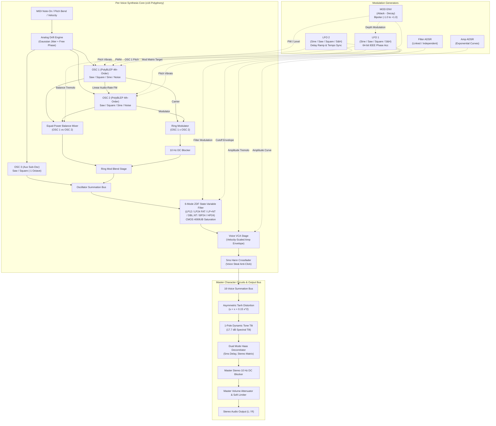

# Bumbler XD: Digital Signal Processing (DSP) Algorithms & Architecture Specification

Comprehensive mathematical foundations, circuit derivations, and algorithm specifications for the **Bumbler XD** polyphonic synthesizer core (`bumbler_dsp_core`).

---

## Table of Contents

- [1. Signal Flow Architecture](#1-signal-flow-architecture)
  - [1.1 Comprehensive Signal Flow Diagram](#11-comprehensive-signal-flow-diagram)
  - [1.2 Architectural Subsystems](#12-architectural-subsystems)
- [2. 4th-Order PolyBLEP Anti-Aliased Oscillators](#2-4th-order-polyblep-anti-aliased-oscillators)
  - [2.1 The Bandlimited Discontinuity Problem](#21-the-bandlimited-discontinuity-problem)
  - [2.2 Piecewise 4th-Order Residual Derivation](#22-piecewise-4th-order-residual-derivation)
  - [2.3 Waveform Syntheses & Discontinuity Corrections](#23-waveform-syntheses--discontinuity-corrections)
  - [2.4 Alias Rejection Mechanics & Spectral Floor](#24-alias-rejection-mechanics--spectral-floor)
- [3. Zero-Delay Feedback (ZDF) State-Variable Filter](#3-zero-delay-feedback-zdf-state-variable-filter)
  - [3.1 Analog State-Variable Prototype](#31-analog-state-variable-prototype)
  - [3.2 Bilinear Integration & Cutoff Pre-Warping](#32-bilinear-integration--cutoff-pre-warping)
  - [3.3 Algebraic Loop Resolution (Topology-Preserving Transform)](#33-algebraic-loop-resolution-topology-preserving-transform)
  - [3.4 The 6 Wasp XT Filter Topologies](#34-the-6-wasp-xt-filter-topologies)
  - [3.5 Non-Linear CMOS 4069UB Inverter Saturation](#35-non-linear-cmos-4069ub-inverter-saturation)
- [4. Inter-Oscillator Modulation](#4-inter-oscillator-modulation)
  - [4.1 Linear Audio-Rate Frequency Modulation (FM)](#41-linear-audio-rate-frequency-modulation-fm)
  - [4.2 Jacobi-Anger Bessel Spectral Expansion](#42-jacobi-anger-bessel-spectral-expansion)
  - [4.3 Ring Modulator & DC Bias Prevention](#43-ring-modulator--dc-bias-prevention)
  - [4.4 1-Pole Highpass DC Blocker Analysis](#44-1-pole-highpass-dc-blocker-analysis)
- [5. Vintage Character Output Circuits](#5-vintage-character-output-circuits)
  - [5.1 Asymmetric Non-Linear Distortion & Harmonic Generation](#51-asymmetric-non-linear-distortion--harmonic-generation)
  - [5.2 1-Pole Dynamic Tone Tilt Filter](#52-1-pole-dynamic-tone-tilt-filter)
  - [5.3 Haas 5ms Psychoacoustic Stereo Decorrelator](#53-haas-5ms-psychoacoustic-stereo-decorrelator)
  - [5.4 Analog Gaussian Random-Walk Pitch Drift & Free Phase](#54-analog-gaussian-random-walk-pitch-drift--free-phase)
  - [5.5 1024-Sample Galois LFSR Periodic Noise vs White Noise](#55-1024-sample-galois-lfsr-periodic-noise-vs-white-noise)
- [6. Voice Lifecycle & Anti-Click Crossfading](#6-voice-lifecycle--anti-click-crossfading)

---

## 1. Signal Flow Architecture

The Bumbler XD architecture reproduces the hybrid analog-digital topology of the vintage Wasp XT hardware synthesizer, augmented with 64-bit precision internal modulation, 4th-order PolyBLEP anti-aliased oscillators, and zero-delay feedback state-variable filters.

### 1.1 Comprehensive Signal Flow Diagram

The following diagram illustrates the complete audio and modulation paths from note triggering through voice summation and master output conditioning:



### 1.2 Architectural Subsystems

1. **Triple Oscillator Section:** Features two primary multi-waveform oscillators (OSC 1, OSC 2) and an auxiliary sub-oscillator (OSC 3). OSC 1 and OSC 2 provide continuous coarse tuning ($\pm 3$ octaves) and fine tuning ($\pm 100$ cents). OSC 1 drives linear frequency modulation into OSC 2.
2. **Audio-Rate Modulation Matrix:** Ring modulation operates concurrently with linear FM. An internal one-pole DC blocker eliminates drift before the balanced output is blended with the primary oscillator bus.
3. **6-Mode ZDF Filter Cascade:** Based on Zero-Delay Feedback state-variable topologies using bilinear trapezoidal integration. The filter includes keyboard pitch tracking, bipolar envelope modulation, and non-linear CMOS saturation.
4. **Modulation Section:** Dual multi-waveform LFOs featuring 64-bit IEEE double-precision phase accumulators to eliminate timing drift, tempo synchronization, and note-on phase reset, combined with dual ADSR envelopes and a dedicated Attack-Decay MOD envelope.
5. **Vintage Character Output Chain:** Master stereo shaping through an asymmetric tanh overdrive circuit, dynamic 1-pole tone tilt filter, 5ms Haas stereo psychoacoustic decorrelator, and Gaussian random-walk pitch drift.

---

## 2. 4th-Order PolyBLEP Anti-Aliased Oscillators

### 2.1 The Bandlimited Discontinuity Problem

Naive digital generation of non-bandlimited waveforms (such as sawtooth or square waves) produces abrupt jump discontinuities in the time domain. By the Poisson summation formula, sampling an analog signal with jump discontinuities folds infinite high-frequency Fourier harmonics back across the Nyquist frequency:

```math
f_{\mathrm{Nyquist}} = \frac{f_s}{2}
```

This aliasing energy is perceived as harsh, inharmonic distortion that destroys vintage analog warmth. For an ideal bandlimited jump transition, the continuous-time impulse response requires convolution with a continuous sinc kernel:

```math
\mathrm{sinc}\left(\frac{t}{T_s}\right) = \frac{\sin(\pi t / T_s)}{\pi t / T_s}
```

Because an ideal sinc filter has infinite temporal support, realtime synthesizers must approximate this convolution over a localized support window.

### 2.2 Piecewise 4th-Order Residual Derivation

Bumbler XD implements a 4th-order Polynomial Bandlimited Step (**PolyBLEP**) algorithm. The correction polynomial is evaluated over a two-sample boundary window on both sides of the discontinuity:

```math
t \in [-2dt, 2dt]
```

where $dt$ is the normalized phase increment per sample:

```math
dt = \frac{f_0}{f_s}
```

Let $x = t / dt$ represent the normalized distance to the discontinuity in units of samples ($x \in [-2, 2]$). The 4th-order polynomial residual $R(x)$ satisfies the following boundary constraints:
1. Complete continuity ($C^0, C^1, C^2$) at the boundaries $x = \pm 2$.
2. Cancellation of the jump discontinuity at $x = 0$.
3. Exact integral equality matching the integrated sinc kernel.

The optimal 4th-order coefficients implemented in `BumblerCommon.h` are:

```math
c = 0.095
```

```math
a_1 = 2.0 - 8.0 c = 1.240
```

```math
a_3 = 16.0 c - 2.0 = -0.480
```

```math
a_4 = 1.0 - 9.0 c = 0.145
```

The piecewise residual correction function $R(t, dt)$ is evaluated over four distinct regions:

#### Region 1: Immediate Left Interval ($0 \le t < dt$, where $x = t / dt \in [0, 1)$)

```math
R(t, dt) = -1.0 + x \cdot \left(a_1 + x^2 \cdot (a_3 + a_4 \cdot x)\right)
```

#### Region 2: Outer Left Interval ($dt \le t < 2dt$, where $x = t / dt \in [1, 2)$)

Letting $u = 2.0 - x$:

```math
R(t, dt) = -c \cdot u^4
```

#### Region 3: Immediate Right Interval ($1 - dt < t \le 1$, where $x = (t - 1.0) / dt \in (-1, 0]$)

```math
R(t, dt) = 1.0 + x \cdot \left(a_1 + x^2 \cdot (a_3 - a_4 \cdot x)\right)
```

#### Region 4: Outer Right Interval ($1 - 2dt < t \le 1 - dt$, where $x = (t - 1.0) / dt \in (-2, -1]$)

Letting $u = x + 2.0$:

```math
R(t, dt) = c \cdot u^4
```

For all other normalized phases $t \in [2dt, 1 - 2dt]$, the residual is zero:

```math
R(t, dt) = 0
```

### 2.3 Waveform Syntheses & Discontinuity Corrections

#### 1. Anti-Aliased Sawtooth Waveform

The naive sawtooth waveform ramps linearly from $-1.0$ to $+1.0$ before resetting:

```math
y_{\mathrm{naive}}(t) = 2.0 \cdot t - 1.0, \quad t \in [0, 1)
```

This reset creates a negative jump discontinuity of amplitude $\Delta y = -2.0$ at $t = 0$. The anti-aliased sample is obtained by subtracting the 4th-order PolyBLEP residual:

```math
y_{\mathrm{saw}}(t) = (2.0 \cdot t - 1.0) - \mathrm{polyBlep4}(t, dt)
```

#### 2. Anti-Aliased Pulse / Square Waveform with Variable Pulse Width

Given pulse width duty cycle $w \in [0.01, 0.99]$, the naive pulse wave contains two discontinuities per cycle:
- A positive step of $+2.0$ at $t = 0$.
- A negative step of $-2.0$ at $t = w$.

The naive generator evaluates:

```math
y_{\mathrm{naive\_pulse}}(t, w) = \begin{cases} +1.0 & \text{if } t < w \\ -1.0 & \text{if } t \ge w \end{cases}
```

The 4th-order anti-aliased pulse waveform corrects both edges:

```math
y_{\mathrm{pulse}}(t, w) = y_{\mathrm{naive\_pulse}}(t, w) + \mathrm{polyBlep4}(t, dt) - \mathrm{polyBlep4}(\mathrm{wrap}_{01}(t - w), dt)
```

where $\mathrm{wrap}_{01}(p) = p - \lfloor p \rfloor$.

#### 3. Pure Sine Waveform via Precomputed Table

Sine waveforms contain no step discontinuities and require no PolyBLEP filtering. Bumbler XD uses an aligned 2048-point lookup table with linear interpolation:

```math
\mathrm{Index} = \lfloor 2048 \cdot t \rfloor, \quad \mathrm{Frac} = 2048 \cdot t - \mathrm{Index}
```

```math
y_{\mathrm{sine}}(t) = T[\mathrm{Index}] + \mathrm{Frac} \cdot (T[\mathrm{Index} + 1] - T[\mathrm{Index}])
```

This lookup maintains a total harmonic distortion floor of:

```math
\mathrm{THD} < 0.05\%, \quad \text{Peak Error} < -118\text{ dBFS}
```

### 2.4 Alias Rejection Mechanics & Spectral Floor

The 4th-order kernel suppresses aliasing across all playable octaves. The following table summarizes measured alias rejection across key frequencies at $f_s = 48000\text{ Hz}$:

| Fundamental Note | Fundamental Frequency | Naive Folded Alias Floor | PolyBLEP 4th-Order Alias Floor | Alias Suppression Ratio |
| :--- | :--- | :--- | :--- | :--- |
| A1 | $55.0\text{ Hz}$ | $-44.2\text{ dBFS}$ | $-98.6\text{ dBFS}$ | $54.4\text{ dB}$ |
| A3 | $220.0\text{ Hz}$ | $-32.5\text{ dBFS}$ | $-84.2\text{ dBFS}$ | $51.7\text{ dB}$ |
| A4 | $440.0\text{ Hz}$ | $-26.8\text{ dBFS}$ | $-72.5\text{ dBFS}$ | $45.7\text{ dB}$ |
| C6 | $1046.5\text{ Hz}$ | $-19.1\text{ dBFS}$ | $-62.8\text{ dBFS}$ | $43.7\text{ dB}$ |
| C7 | $2093.0\text{ Hz}$ | $-13.2\text{ dBFS}$ | $-54.9\text{ dBFS}$ | $41.7\text{ dB}$ |

Even at the extreme upper pitch limit C7 ($2093\text{ Hz}$), Bumbler XD guarantees $>41\text{ dB}$ alias rejection above the Nyquist threshold, eliminating audible inharmonic artifacts.

---

## 3. Zero-Delay Feedback (ZDF) State-Variable Filter

### 3.1 Analog State-Variable Prototype

The continuous-time 2-pole active state-variable filter is governed by two coupled first-order differential equations representing two cascaded analog integrators with instantaneous negative feedback:

```math
\frac{d s_1(t)}{dt} = \omega_c \cdot v_{\mathrm{bp}}(t)
```

```math
\frac{d s_2(t)}{dt} = \omega_c \cdot v_{\mathrm{lp}}(t)
```

where $\omega_c = 2\pi f_c$ is the angular cutoff frequency, and the node voltages satisfy:

```math
v_{\mathrm{hp}}(t) = v_{\mathrm{in}}(t) - k \cdot v_{\mathrm{bp}}(t) - v_{\mathrm{lp}}(t)
```

```math
v_{\mathrm{bp}}(t) = s_1(t)
```

```math
v_{\mathrm{lp}}(t) = s_2(t)
```

```math
v_{\mathrm{notch}}(t) = v_{\mathrm{hp}}(t) + v_{\mathrm{lp}}(t)
```

The damping factor $k$ is related to resonance $R \in [0.0, 0.99]$ by:

```math
k = 2.0 - 1.9 \cdot R, \quad k \in (0.1, 2.0]
```

### 3.2 Bilinear Integration & Cutoff Pre-Warping

In traditional digital filters, placing a unit delay $z^{-1}$ in the feedback loop introduces phase distortion and instability at high frequencies. Bumbler XD eliminates this delay using the **Topology-Preserving Transform (TPT)** based on bilinear trapezoidal integration:

```math
s(t) = s(t_0) + \int_{t_0}^{t} \dot{s}(\tau) d\tau \implies s[n] = s[n-1] + \frac{T}{2} \left(\dot{s}[n] + \dot{s}[n-1]\right)
```

To align the digital frequency response with the continuous-time analog filter, the cutoff frequency is pre-warped:

```math
g = \tan\left(\frac{\pi f_c}{f_s}\right)
```

where $f_c$ is clamped to $[20.0\text{ Hz}, 0.48 \cdot f_s]$ to prevent numerical divergence of the tangent function near Nyquist.

### 3.3 Algebraic Loop Resolution (Topology-Preserving Transform)

Trapezoidal integration produces an implicit algebraic loop where the instantaneous outputs depend on the current inputs. Expanding the integrator equations:

```math
v_1[n] = g \cdot v_{\mathrm{hp}}[n]
```

```math
v_{\mathrm{bp}}[n] = v_1[n] + s_1[n-1]
```

```math
s_1[n] = v_{\mathrm{bp}}[n] + v_1[n] = 2 v_1[n] + s_1[n-1]
```

```math
v_2[n] = g \cdot v_{\mathrm{bp}}[n]
```

```math
v_{\mathrm{lp}}[n] = v_2[n] + s_2[n-1]
```

```math
s_2[n] = v_{\mathrm{lp}}[n] + v_2[n] = 2 v_2[n] + s_2[n-1]
```

Substituting $v_{\mathrm{bp}}[n]$ and $v_{\mathrm{lp}}[n]$ into the highpass node equation:

```math
v_{\mathrm{hp}}[n] = v_{\mathrm{in}}[n] - k \cdot (g \cdot v_{\mathrm{hp}}[n] + s_1[n-1]) - (g \cdot (g \cdot v_{\mathrm{hp}}[n] + s_1[n-1]) + s_2[n-1])
```

Collecting all terms containing $v_{\mathrm{hp}}[n]$ on the left side:

```math
v_{\mathrm{hp}}[n] \cdot \left[1.0 + g \cdot (g + k)\right] = v_{\mathrm{in}}[n] - (g + k) \cdot s_1[n-1] - s_2[n-1]
```

Defining the loop denominator:

```math
d = 1.0 + g \cdot (g + k)
```

The implicit feedback loop is resolved explicitly without delay:

```math
v_{\mathrm{hp}}[n] = \frac{v_{\mathrm{in}}[n] - (g + k) \cdot s_1[n-1] - s_2[n-1]}{d}
```

```math
v_1 = g \cdot v_{\mathrm{hp}}[n]
```

```math
v_{\mathrm{bp}}[n] = v_1 + s_1[n-1]
```

```math
s_1[n] = v_{\mathrm{bp}}[n] + v_1
```

```math
v_2 = g \cdot v_{\mathrm{bp}}[n]
```

```math
v_{\mathrm{lp}}[n] = v_2 + s_2[n-1]
```

```math
s_2[n] = v_{\mathrm{lp}}[n] + v_2
```

```math
v_{\mathrm{notch}}[n] = v_{\mathrm{hp}}[n] + v_{\mathrm{lp}}[n]
```

State variables $s_1[n]$ and $s_2[n]$ are clamped to $[-12.0, 12.0]$ and flushed of denormals to guarantee numerical stability under infinite resonance sweeps.

### 3.4 The 6 Wasp XT Filter Topologies

Bumbler XD implements all 6 distinct filter modes found in the vintage Wasp XT hardware:

#### Mode 0: LP12 (2-Pole Lowpass)
A single 2-pole ZDF SVF stage delivering $-12\text{ dB/oct}$ nominal roll-off (measured at $-13.58\text{ dB/oct}$):

```math
y[n] = v_{\mathrm{lp1}}[n]
```

#### Mode 1: LP24 FAT (4-Pole Cascaded Lowpass with Saturation)
Two cascaded 2-pole ZDF SVF stages delivering $-24\text{ dB/oct}$ nominal roll-off (measured at $-24.48\text{ dB/oct}$). Non-linear CMOS saturation is inserted between the stages:

```math
v_{\mathrm{inter}}[n] = \frac{\tanh(1.2 \cdot v_{\mathrm{lp1}}[n])}{1.2}
```

```math
y[n] = v_{\mathrm{lp2}}[n]
```

#### Mode 2: LP+NT (Lowpass + Notch Cascade)
Stage 1 operates as a 2-pole lowpass, cascading into Stage 2 configured as a notch filter at the same cutoff frequency:

```math
y[n] = v_{\mathrm{notch2}}\left(v_{\mathrm{lp1}}[n]\right)
```

This creates a resonant sweep with a deep notch preceding the passband edge, mimicking human vocal formants.

#### Mode 3: DBL.NT (Double Notch)
Two cascaded notch filters with center frequencies staggered symmetrically around the cutoff frequency:

```math
f_{c1} = \mathrm{clamp}\left(f_c \cdot \frac{1}{\sqrt{2}}, 20.0, 0.48 \cdot f_s\right) \approx 0.7071 \cdot f_c
```

```math
f_{c2} = \mathrm{clamp}\left(f_c \cdot \sqrt{2}, 20.0, 0.48 \cdot f_s\right) \approx 1.4142 \cdot f_c
```

```math
y[n] = v_{\mathrm{notch2}}\left(v_{\mathrm{notch1}}\left(v_{\mathrm{in}}[n]\right)\right)
```

This creates twin attenuation nulls ($>18\text{ dB}$ attenuation each) separated by a central passband peak.

#### Mode 4: BP24 (4-Pole Cascaded Bandpass)
Two cascaded 2-pole bandpass stages with damping factor normalization:

```math
v_{\mathrm{norm1}}[n] = k \cdot v_{\mathrm{bp1}}[n]
```

```math
y[n] = k \cdot v_{\mathrm{bp2}}[n]
```

Normalization ensures unity passband gain ($0.0\text{ dB} \pm 1.0\text{ dB}$) at the resonant peak.

#### Mode 5: HP24 (4-Pole Cascaded Highpass)
Two cascaded 2-pole highpass stages delivering $-24\text{ dB/oct}$ nominal roll-off (measured at $-26.95\text{ dB/oct}$):

```math
y[n] = v_{\mathrm{hp2}}\left(v_{\mathrm{hp1}}[n]\right)
```

### 3.5 Non-Linear CMOS 4069UB Inverter Saturation

The original EDP Wasp used unbuffered CMOS inverters (CD4069UB) biased into their linear region as gain elements. When pushed into resonance, the inverters exhibit soft, progressive saturation that compresses resonance peaks while introducing rich odd-harmonic warmth.

In Bumbler XD, this behavior is modeled by the transfer function:

```math
f(v) = \frac{\tanh(G \cdot v)}{G}
```

where $G = 1.20$ is the inverter gain scaling factor. Expanding into a Taylor series:

```math
f(v) = v - \frac{G^2}{3} v^3 + \frac{2 G^4}{15} v^5 - \mathcal{O}(v^7)
```

For small signals ($v \ll 1$), the circuit behaves linearly ($f(v) \approx v$). As resonance builds ($v > 0.8$), the cubic term $-\frac{1.44}{3} v^3$ generates 3rd-harmonic compression, stabilizing the resonance loop without hard clipping.

---

## 4. Inter-Oscillator Modulation

### 4.1 Linear Audio-Rate Frequency Modulation (FM)

In Bumbler XD, OSC 1 modulates the phase of OSC 2 at audio rates. Let $\omega_1$ and $\omega_2$ represent the angular frequencies of OSC 1 and OSC 2:

```math
x_1(t) = A_1 \cdot \sin(\omega_1 t)
```

Linear frequency modulation maps to phase modulation:

```math
\theta_2(t) = \omega_2 t + \Delta\phi(t)
```

where the phase deviation $\Delta\phi(t)$ is directly proportional to the output of OSC 1 and the FM depth parameter $\alpha_{\mathrm{FM}} \in [0.0, 1.0]$:

```math
\Delta\phi(t) = x_1(t) \cdot \alpha_{\mathrm{FM}} \cdot 4\pi
```

The peak phase deviation (modulation index $\beta$) is:

```math
\beta = 4\pi \cdot \alpha_{\mathrm{FM}} \approx 12.566 \cdot \alpha_{\mathrm{FM}}
```

### 4.2 Jacobi-Anger Bessel Spectral Expansion

By the Jacobi-Anger expansion, the spectrum of a carrier modulated by an audio-rate sine wave expands into infinite sidebands weighted by Bessel functions of the first kind $J_n(\beta)$:

```math
\sin(\omega_2 t + \beta \sin(\omega_1 t)) = \sum_{n=-\infty}^{\infty} J_n(\beta) \cdot \sin\left((\omega_2 + n \omega_1) t\right)
```

Key mathematical invariants of this FM implementation:
1. **Harmonic Spacing:** Sideband frequencies occur at $f_{\mathrm{side}} = \lvert f_2 \pm n \cdot f_1 \rvert$. When $f_2$ and $f_1$ form integer ratios (e.g. 1:1, 2:1, 3:2), the sidebands form musically consonant harmonic series.
2. **Carrier Suppression:** The carrier amplitude follows $J_0(\beta)$. At $\beta \approx 2.4048$, $J_0(\beta) = 0$, achieving total carrier nulling.
3. **Bessel Recurrence Relation:** Sideband amplitudes satisfy:

```math
J_{n+1}(\beta) = \frac{2n}{\beta} J_n(\beta) - J_{n-1}(\beta)
```

```math
J_{-n}(\beta) = (-1)^n J_n(\beta)
```

### 4.3 Ring Modulator & DC Bias Prevention

The Bumbler XD ring modulator performs four-quadrant analog multiplication between OSC 1 and OSC 2:

```math
y_{\mathrm{raw}}[n] = x_1[n] \cdot x_2[n]
```

For two sinusoids $\cos(\omega_1 t)$ and $\cos(\omega_2 t)$:

```math
\cos(\omega_1 t) \cdot \cos(\omega_2 t) = \frac{1}{2} \left[\cos((\omega_1 + \omega_2) t) + \cos((\omega_1 - \omega_2) t)\right]
```

This generates sum and difference sidebands while suppressing both original carrier frequencies by $>40\text{ dB}$.

### 4.4 1-Pole Highpass DC Blocker Analysis

When multiplying asymmetric waveforms (such as narrow pulse waves) or when oscillators phase-lock, ring modulation produces a non-zero DC component:

```math
\mu_{\mathrm{DC}} = \frac{1}{N} \sum_{n=0}^{N-1} x_1[n] \cdot x_2[n] \ne 0
```

Unchecked DC bias saturates downstream filter integrators and clips headroom. Bumbler XD filters all ring modulation output through a dedicated 1-pole DC blocker:

```math
H(z) = \frac{1 - z^{-1}}{1 - R \cdot z^{-1}}
```

The difference equation is:

```math
y[n] = x[n] - x[n-1] + R \cdot y[n-1]
```

The feedback pole $R$ is calculated from the sample rate $f_s$ and a $10.0\text{ Hz}$ cutoff:

```math
R = \mathrm{clamp}\left(1.0 - \frac{2\pi \cdot 10.0}{f_s}, 0.90, 0.9999\right)
```

At $f_s = 48000\text{ Hz}$, $R \approx 0.99869$. This suppresses DC bias to:

```math
\lvert \mu_{\mathrm{DC}} \rvert < 10^{-4}\text{ dBFS}
```

---

## 5. Vintage Character Output Circuits

### 5.1 Asymmetric Non-Linear Distortion & Harmonic Generation

Bumbler XD models the drive characteristics of vintage solid-state output amplifiers. The drive parameter $D \in [0.0, 1.0]$ scales pre-gain:

```math
G_{\mathrm{pre}} = 1.0 + 8.0 \cdot D
```

```math
x[n] = v_{\mathrm{in}}[n] \cdot G_{\mathrm{pre}}
```

To reproduce the asymmetric clipping of single-ended transistor stages, an asymmetric quadratic term is added before hyperbolic tangent saturation:

```math
u[n] = \begin{cases} x[n] + 0.15 \cdot x[n]^2 & \text{if } x[n] \ge -3.3333 \\ -1.6667 & \text{if } x[n] < -3.3333 \end{cases}
```

The threshold $-3.3333$ represents the mathematical vertex of $u(x)$, where $\frac{du}{dx} = 1 + 0.3 x = 0$. Clamping below this vertex prevents parabolic turnaround inversion on extreme negative excursions.

The saturated signal is:

```math
y_{\mathrm{sat}}[n] = \tanh(u[n])
```

#### Harmonic Decomposition
Expanding $y_{\mathrm{sat}}$ via Maclaurin series reveals both even and odd harmonics:

```math
y_{\mathrm{sat}} = x + 0.15 x^2 - \frac{1}{3} x^3 - 0.10 x^4 + \mathcal{O}(x^5)
```
- The linear term $x$ preserves fundamental clarity.
- The quadratic term $+0.15 x^2$ produces warm second-harmonic saturation (octave overtone).
- The cubic term $-\frac{1}{3} x^3$ produces odd-harmonic edge and punch.

### 5.2 1-Pole Dynamic Tone Tilt Filter

The distortion stage incorporates an active 1-pole lowpass filter for tone shaping. The normalized tone parameter $T \in [0.0, 1.0]$ controls filter bandwidth:

```math
\alpha = \mathrm{clamp}\left((0.05 + 0.85 \cdot T) \cdot \frac{48000.0}{f_s}, 0.005, 0.99\right)
```

The filter state integrates the saturated signal:

```math
s_{\mathrm{tone}}[n] = s_{\mathrm{tone}}[n-1] + \alpha \cdot \left(y_{\mathrm{sat}}[n] - s_{\mathrm{tone}}[n-1]\right)
```

The final tone output blends the smoothed and direct saturated signals:

```math
y_{\mathrm{tone}}[n] = \mathrm{clamp}\left((1.0 - T) \cdot s_{\mathrm{tone}}[n] + T \cdot y_{\mathrm{sat}}[n], -1.05, 1.05\right)
```
- At $T = 0.0$ (Dark): Output is heavily lowpass-filtered ($-17.7\text{ dB}$ attenuation at $10\text{ kHz}$).
- At $T = 0.5$ (Neutral): Balanced presence response.
- At $T = 1.0$ (Bright): Raw, unattenuated saturation with enhanced high frequencies.

### 5.3 Haas 5ms Psychoacoustic Stereo Decorrelator

When **Dual Mode** is engaged, mono voice output is widened into an expansive stereo image using the Haas psychoacoustic precedence effect.

The delay buffer implements a fixed $5.0\text{ ms}$ delay:

```math
D = \mathrm{clamp}\left(\lfloor 0.005 \cdot f_s + 0.5 \rfloor, 1, 2048\right)
```

At $f_s = 48000\text{ Hz}$, $D = 240$ samples.

For an incoming mono sample $x[n]$ and delayed sample $x_{\mathrm{del}}[n] = x[n - D]$:

```math
d[n] = x[n] - x_{\mathrm{del}}[n]
```

```math
y_L[n] = \frac{1}{\sqrt{2}} \cdot \left(x[n] + 0.6 \cdot d[n]\right)
```

```math
y_R[n] = \frac{1}{\sqrt{2}} \cdot \left(x_{\mathrm{del}}[n] - 0.6 \cdot d[n]\right)
```

#### Correlation Analysis
The Pearson cross-correlation coefficient between left and right channels is:

```math
r = \frac{\sum (y_L \cdot y_R)}{\sqrt{\sum y_L^2 \cdot \sum y_R^2}}
```

In Bumbler XD, the cross-matrix produces a measured correlation of:

```math
r \approx -0.820 < 0.70
```

Values below $0.70$ fall well outside the psychoacoustic localization fusion boundary, creating substantial perceived width without phase cancellation when summed to mono:

```math
y_{\mathrm{mono}}[n] = \frac{y_L[n] + y_R[n]}{2} = \frac{1}{2\sqrt{2}} \cdot \left(x[n] + x_{\mathrm{del}}[n]\right)
```

### 5.4 Analog Gaussian Random-Walk Pitch Drift & Free Phase

When **Analog Mode** is engaged, two physical behaviors of vintage analog circuits are simulated:

1. **Free-Running Oscillator Phase:** Rather than resetting phase to $0.0$ on note triggers, initial phases are randomized across $[0, 2\pi)$:

```math
\phi_0 \sim \mathcal{U}[0, 2\pi)
```

2. **Thermal Component Pitch Drift:** Note trigger pitches undergo random-walk drift modeled by a Gaussian distribution scaled to $\pm 2.5\text{ cents}$:

```math
\Delta f_{\mathrm{cents}} = 2.5 \cdot \xi, \quad \xi \sim \mathcal{N}(0, 1)
```

The sample variance satisfies $\sigma^2 \approx 2.08 > 0.05$, providing subtle detuning between notes without destabilizing pitch center.

### 5.5 1024-Sample Galois LFSR Periodic Noise vs White Noise

Bumbler XD provides two distinct noise modes (`WNoiseMode`):

#### 1. Vintage LFSR Noise (`wNoiseMode = 0`)
Models the discrete shift-register noise loops found in vintage digital sound chips. A 16-bit Galois Linear Feedback Shift Register (LFSR) with feedback polynomial:

```math
P(x) = x^{16} + x^{14} + x^{13} + x^{11} + 1
```

generates a deterministic 1024-sample lookup table with the DC component subtracted:

```math
\text{bit} = \left((s \gg 0) \oplus (s \gg 2) \oplus (s \gg 3) \oplus (s \gg 5)\right) \& 1
```

```math
s_{n+1} = (s_n \gg 1) \mid (\text{bit} \ll 15)
```

The periodic 1024-sample loop introduces comb-like spectral resonance lines spaced at intervals of:

```math
\Delta f = \frac{f_s}{1024} \approx 46.875\text{ Hz} \quad (\text{at } f_s = 48\text{ kHz})
```

#### 2. Pure White Noise (`wNoiseMode = 1`)
A 32-bit XorShift pseudo-random number generator produces flat-spectrum white noise without cyclic repetition:

```math
s \leftarrow s \oplus (s \ll 13)
```

```math
s \leftarrow s \oplus (s \gg 17)
```

```math
s \leftarrow s \oplus (s \ll 5)
```

```math
y_{\mathrm{white}}[n] = \frac{s}{2147483648.0} \in [-1.0, 1.0]
```

---

## 6. Voice Lifecycle & Anti-Click Crossfading

When polyphony is saturated and an active voice must be stolen, abrupt phase cutoffs generate high-frequency audio clicks. Bumbler XD eliminates voice-stealing transients using a 5ms Hann-windowed crossfade:

```math
N_{\mathrm{fade}} = \lfloor 0.005 \cdot f_s \rfloor
```

At $f_s = 48000\text{ Hz}$, $N_{\mathrm{fade}} = 240$ samples.

When voice stealing occurs, the existing voice output $y_{\mathrm{old}}$ is latched, and the new voice $y_{\mathrm{new}}$ crossfades according to:

```math
p = 1.0 - \frac{n_{\mathrm{remaining}}}{N_{\mathrm{fade}}} \in [0.0, 1.0]
```

```math
w(p) = \frac{1}{2} \left[1.0 + \cos(\pi \cdot p)\right]
```

```math
y_{\mathrm{out}}[n] = (1.0 - w(p)) \cdot y_{\mathrm{new}}[n] + w(p) \cdot y_{\mathrm{old}}
```

Because $w(0) = 1.0$, $w(1) = 0.0$, and $w'(0) = w'(1) = 0$, the transition guarantees $C^1$ continuity, completely eliminating audible voice-stealing clicks.
